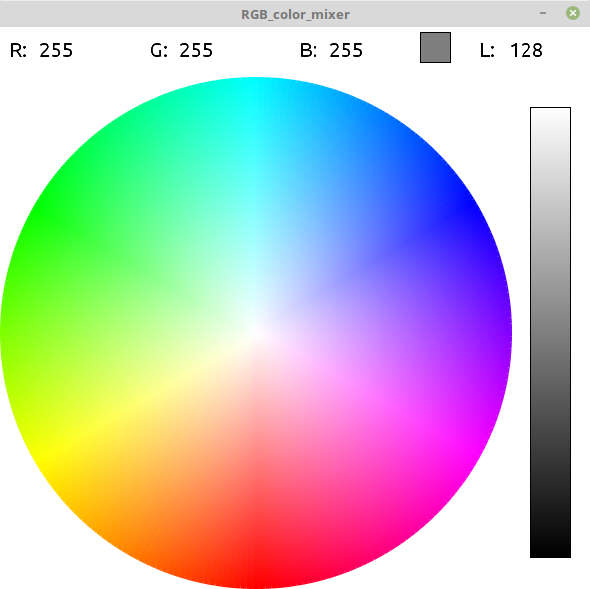

# Arduino-RGB-led-strip (GUI or command line)
Arduino + processing rbg led strip controlling

## Arduino
Receives a [xxx.xxx.xxx] int value via serial where xxx is a integer between 0 and 255 (In this example is used a . as delimiter, but whatever character that ins't a number works).

Color code can be sent by whatever program that can estabilish a serial connection with arduino. (Including terminal)

## Processing
Processing code is basically a GUI to set rgb and luminance values easily.



RGB color mixer and luminance bar.

## Python
Python is used only to generate a cie1931 gamma correction table (8 bit to match arduino pwm)<br>
Thanks to Jared Sanson<br>
Available at http://jared.geek.nz/2013/feb/linear-led-pwm

## Usage
#### On procesing
1. Pick a RGB value from rgb color mixer
2. Apply luminance to rgb values
3. Send values via serial to arduino

#### On arduino
1. Receive rgb values (with luminance applied)
2. Adjust individual rgb colors to reduce color deviance (based on led specific)
3. Adjust gamma to improve color accuracy
4. Send values to leds


## Color correction (led specific)
```c++
//max color led values
#define maxRed    255
#define maxGreen  90
#define maxBlue   57
```
